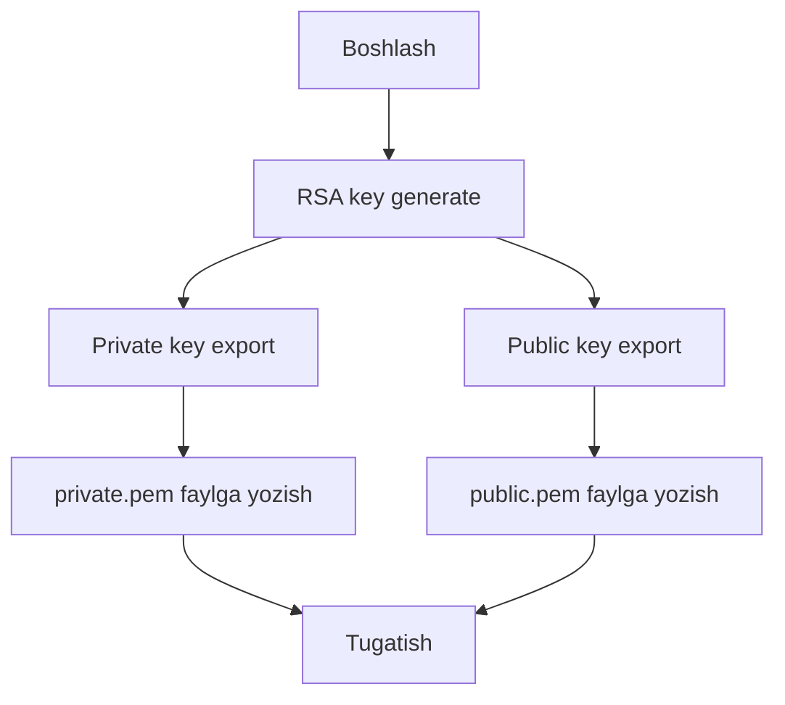
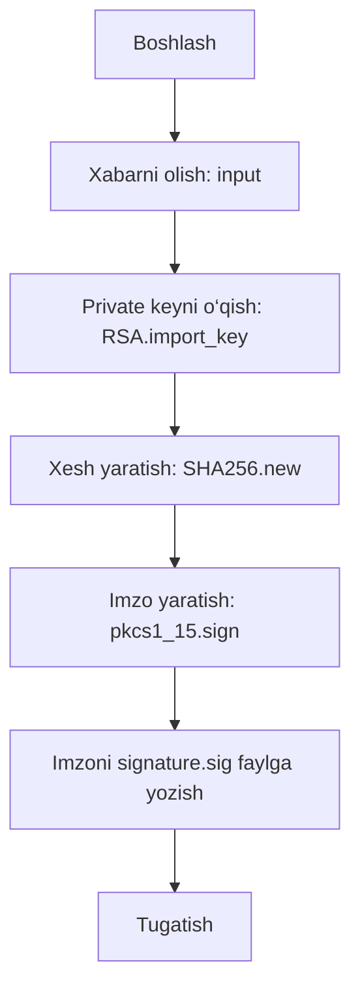
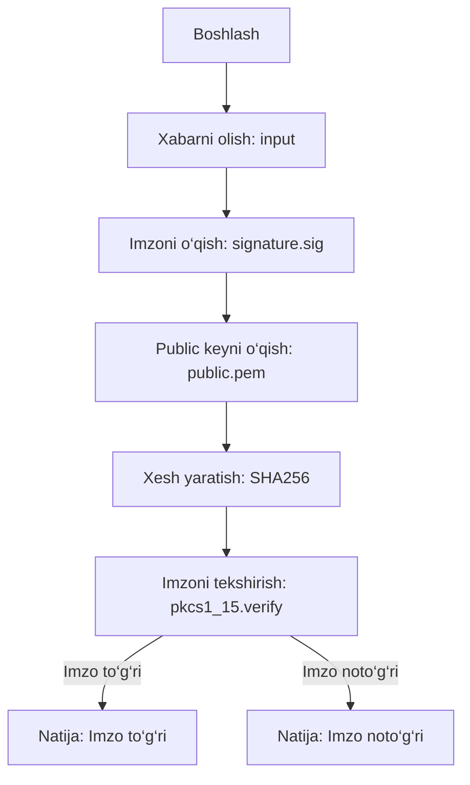

```mermaid
flowchart TD
    A[Boshlash]
    A --> B[RSA key generate]
    B --> C[Private key export]
    B --> D[Public key export]
    C --> E[private.pem faylga yozish]
    D --> F[public.pem faylga yozish]
    E --> G[Tugatish]
    F --> G[Tugatish]
```

```mermaid
flowchart TD
    A[Boshlash]
    A --> B[Xabarni olish: input]
    B --> C[Private keyni o‘qish: RSA.import_key]
    C --> D[Xesh yaratish: SHA256.new]
    D --> E[Imzo yaratish: pkcs1_15.sign]
    E --> F[Imzoni signature.sig faylga yozish]
    F --> G[Tugatish]
```

```mermaid
flowchart TD
    A[Boshlash]
    A --> B[Xabarni olish: input]
    B --> C[Imzoni o‘qish: signature.sig]
    C --> D[Public keyni o‘qish: public.pem]
    D --> E[Xesh yaratish: SHA256]
    E --> F[Imzoni tekshirish: pkcs1_15.verify]
    
    F -->|Imzo to‘g‘ri| G[Natija: Imzo to‘g‘ri ]
    F -->|Imzo noto‘g‘ri| H[Natija: Imzo noto‘g‘ri ]
```

